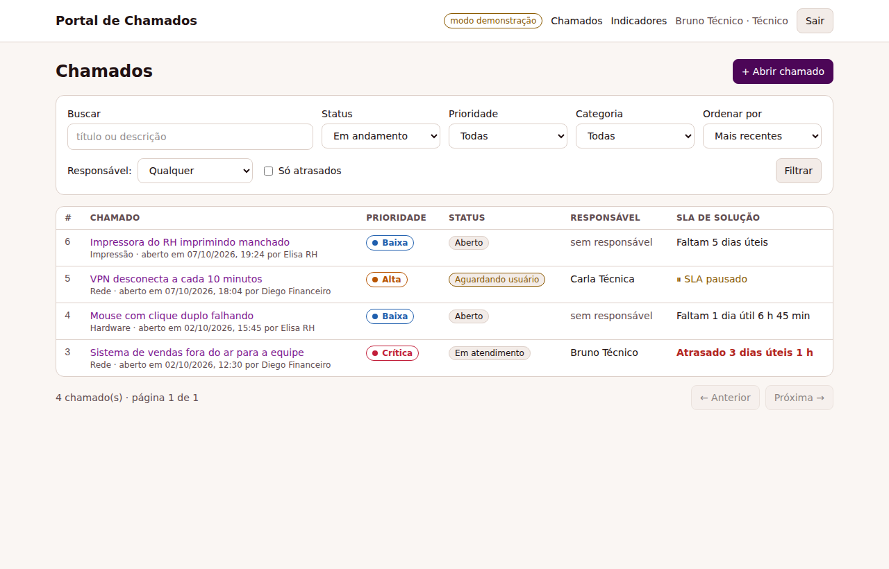
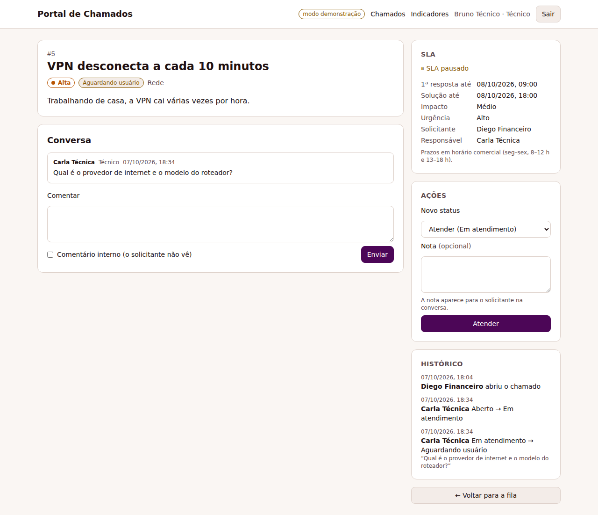

# Portal de Chamados

Front-end em **Next.js 16 + TypeScript** para a minha [API de Chamados em PHP](https://github.com/AdemarChamiNeto/api-chamados).

Pelo portal, o solicitante abre e acompanha os próprios chamados, e a equipe de atendimento trabalha a fila: assume os chamados, muda o status, comenta (inclusive com comentários internos) e acompanha o SLA e os indicadores.

**Demo:** [portal-chamados-swart.vercel.app](https://portal-chamados-swart.vercel.app/) (entre com `bruno@exemplo.com` / `senha-demo-123`)

Sem a API configurada, o portal roda em **modo demonstração**, com dados fictícios em memória, e pode ser publicado sozinho na Vercel.

<p>
  
  
</p>

**Stack:** Next.js 16 (App Router, Server Components, Server Actions, Cache Components) · React 19 · TypeScript · Tailwind CSS 4 · Zod · Vitest + React Testing Library · Playwright · GitHub Actions

## Funcionalidades

- **Login** com o token da API guardado num cookie **httpOnly**. O JavaScript do navegador não tem acesso ao token, e todas as chamadas à API saem do servidor do Next.
- **Fila de chamados:**
  - filtros por status, prioridade, categoria, responsável ("meus", "sem responsável") e "só atrasados";
  - busca, ordenação e paginação;
  - todos os filtros ficam na URL, então dá para salvar e compartilhar a busca.
- **Abertura de chamado:** o usuário informa o impacto e a urgência, e a prioridade aparece na hora, junto com os prazos de SLA, pela matriz ITIL. Os erros de validação vêm do servidor, campo a campo.
- **Detalhe do chamado:**
  - SLA com o tempo restante em horas úteis, pausado enquanto aguarda o usuário;
  - conversa com comentários internos, visíveis só para a equipe;
  - histórico de alterações.
- **Ações conforme o papel:** o portal mostra só as transições que a API permite para quem está logado, e exige nota ao resolver, cancelar ou pedir informação. O técnico pode assumir ou largar o chamado.
- **Indicadores** para a equipe: fila por status, prioridade e categoria, quantidade de chamados atrasados e % de cumprimento do SLA.
- **Acessibilidade:** campos com label e erros ligados por `aria-describedby`, `aria-invalid`, foco visível, link "pular para o conteúdo", tabela com `caption` e tema claro e escuro.

## Arquitetura

```
src/
  proxy.ts                 checagem otimista: sem cookie de sessão → /login?voltar=...
  app/
    actions.ts             Server Actions: login, logout, abrir, mudar status, comentar, assumir
    login/  chamados/  chamados/[id]/  chamados/novo/  indicadores/
  lib/
    api/contract.ts        interface ChamadosApi + ApiError (formato de erro da API)
    api/http.ts            cliente da API real: token, timeout e normalização de erros
    api/demo.ts            mesma interface, em memória, com as regras da API portadas
    server/session.ts      cookie httpOnly + "data access layer" (getSession/requireSession)
    calendar.ts priority.ts filters.ts labels.ts
tests/
  unit/                    Vitest + Testing Library
  e2e/                     Playwright contra o build de produção (modo demonstração)
```

### Decisões

- **BFF (back-end for front-end).** O navegador nunca fala com a API PHP. As páginas são Server Components que buscam os dados no servidor, e as mutações são Server Actions. Assim o JWT fica fora do alcance de XSS e não é preciso configurar CORS.
- **Um contrato, dois back-ends.** `ChamadosApi` tem duas implementações:
  - `HttpChamadosApi`, que fala com a API real;
  - `DemoChamadosApi`, uma cópia em memória das regras dela: matriz ITIL, horário comercial, pausa de SLA, transições por papel e comentários internos.

  As telas não sabem qual das duas está rodando. Os testes do modo demo usam os mesmos casos dos testes da API em PHP.
- **Tratamento de erros central.** Todo request passa por um único método, que faz o papel de interceptor. Ele põe o token, aplica timeout e converte respostas de erro (inclusive falha de rede ou HTML de proxy) em `ApiError`. Um 401 em qualquer ação limpa a sessão e manda para o login com "sua sessão expirou".
- **Cache Components (Next 16).** O layout e os textos fixos saem pré-renderizados. O que depende do usuário (cookie) ou da URL (`searchParams`) roda dentro de `<Suspense>` e chega por streaming. Os dados da API não são cacheados, porque mudam a toda hora; depois de uma ação, `refresh()` re-renderiza a página.
- **URL como estado dos filtros.** Os filtros são um formulário GET (`next/form`), então o voltar do navegador funciona e o link pode ser compartilhado. Valores inválidos na URL são ignorados em vez de quebrar a página.
- **Segurança no login.** O parâmetro `voltar` só aceita caminhos internos, o que evita open redirect. O proxy só confere se o cookie existe; quem valida o token de verdade é a API, a cada request.

## Rodando

```bash
npm install
npm run dev          # http://localhost:3000, em modo demonstração
```

Os usuários de demonstração (senha `senha-demo-123`) aparecem na tela de login:

| usuário | papel |
|---|---|
| `admin@exemplo.com` | admin |
| `bruno@exemplo.com`, `carla@exemplo.com` | técnicos |
| `diego@exemplo.com`, `elisa@exemplo.com` | solicitantes |

**Com a API real:** suba a [api-chamados](https://github.com/AdemarChamiNeto/api-chamados) (por exemplo, `php -S localhost:8080 -t public public/index.php` depois de `php bin/seed.php`) e rode:

```bash
CHAMADOS_API_URL=http://localhost:8080 npm run dev
```

## Testes

```bash
npm test             # 34 testes de unidade e componente (Vitest + Testing Library)
npm run test:e2e     # 6 fluxos de ponta a ponta (Playwright, no build de produção)
npm run lint && npm run typecheck
```

- **Unidade:** calendário útil (os mesmos casos da API em PHP), matriz de prioridade, leitura dos filtros da URL, cliente HTTP (token, query, erros 401/422/503, resposta sem JSON) e as regras do modo demonstração.
- **Componentes:** prévia da prioridade no formulário, nota obrigatória conforme o status e indicador de SLA.
- **E2E:**
  - login inválido;
  - solicitante abrindo chamado, com validação do servidor;
  - técnico assumindo, atendendo e resolvendo;
  - comentário interno invisível para o solicitante;
  - filtros na URL e indicadores;
  - redirecionamento depois do login e sessão inválida.

O CI roda lint, typecheck, testes, build e o Playwright a cada push.

## Deploy na Vercel

1. Importe o repositório em [vercel.com/new](https://vercel.com/new). O framework é detectado sozinho.
2. Sem variáveis de ambiente, o portal sobe em modo demonstração. Para usar a API real, defina `CHAMADOS_API_URL`.

No modo demonstração, os dados ficam na memória de cada instância e voltam ao estado inicial quando ela reinicia. É de propósito: é uma vitrine, não um banco.

## Autor

Ademar C. Neto
